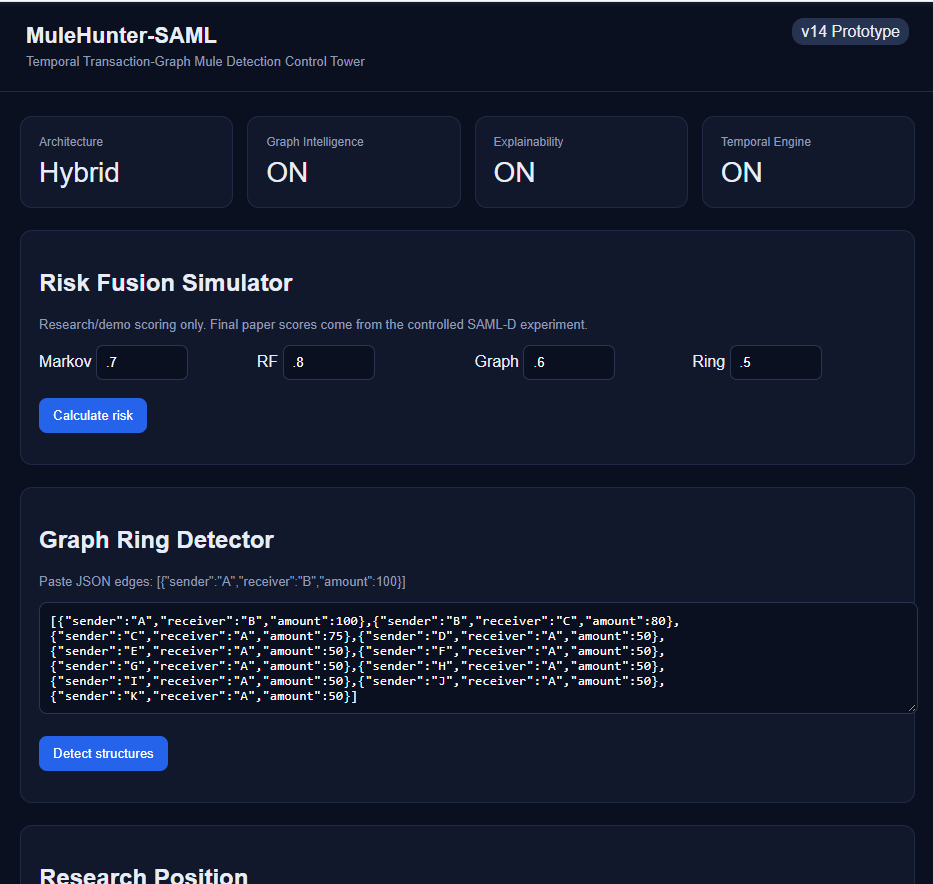

# UPI-MuleHunter

### UPI-Oriented Mule Account Detection using Temporal, Behavioral and Transaction-Graph Learning

UPI-MuleHunter is an academic research prototype for identifying suspicious
mule-account behaviour in digital payment transaction networks.

The system combines:

- Behavioral transaction analysis
- Random Forest risk modeling
- Temporal Markov modeling
- Transaction-graph learning using GraphSAGE
- Multi-signal risk fusion
- Interactive account/transaction investigation
- Intent-aware risk controls for emerging agentic-payment scenarios

> **Research Status:** This repository contains a research prototype.
> Model performance should only be treated as valid after leakage analysis,
> temporal validation, and external-dataset validation.

---

## 🎯 Objectives

- Detect suspicious mule-account behaviour.
- Analyze transaction-level and account-level behaviour.
- Model temporal transaction patterns.
- Learn structural relationships between accounts.
- Combine behavioral, temporal and graph signals.
- Support interactive investigation.
- Explore intent and authorization controls for future agentic payments.

---

## 🏗️ System Architecture

```text
                    UPI / Payment Transaction
                              |
                              v
                 +---------------------------+
                 | Intent & Authority Layer  |
                 | Scope / Limits / Anomaly  |
                 +-------------+-------------+
                               |
             +-----------------+-----------------+
             |                 |                 |
             v                 v                 v
      Behavioral Model   Temporal Model     Graph Model
       Random Forest        Markov           GraphSAGE
             |                 |                 |
             +-----------------+-----------------+
                               |
                               v
                       Risk Fusion Layer
                               |
                +--------------+--------------+
                |                             |
                v                             v
            Mule Risk                     Intent Risk
                |                             |
                +--------------+--------------+
                               |
                               v
                      Decision / Review
                    ALLOW / REVIEW / HOLD

---

## 📚 Documentation

Detailed project documentation:

- [System Architecture](docs/architecture.md)
- [Research Methodology](docs/methodology.md)
- [Dataset Documentation](docs/datasets.md)
- [API Documentation](docs/api.md)
- [Evaluation Protocol](docs/evaluation.md)

---

## 🖥️ Interactive Dashboard

The project includes an interactive research dashboard for exploring:

- Temporal transaction behaviour
- Graph intelligence
- Risk fusion
- Ring detection
- Explainability
- Research/demo risk scoring



> Dashboard risk values are intended for research/demo exploration and should
> not be interpreted as production UPI fraud decisions.

---

## 🔌 API

The backend exposes a FastAPI interface.

Main endpoints include:

| Method | Endpoint | Purpose |
|---|---|---|
| `GET` | `/health` | Health check |
| `POST` | `/api/score` | Risk-signal fusion |
| `POST` | `/api/rings` | Graph-ring detection |
| `POST` | `/api/results/import` | Import research results |
| `GET` | `/api/results/{name}` | Retrieve stored results |

Interactive API documentation is available through FastAPI when the server
is running:

```text
http://localhost:8000/docs
